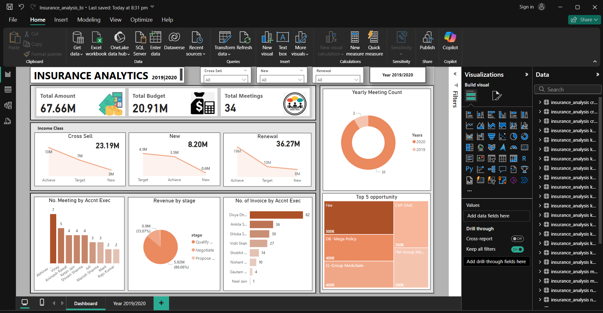

<h1 align="center">👋 Hi, I'm [Your Name]!</h1>
<h3 align="center">🚀 Data Analyst | SQL | Power BI | Tableau | Python | Excel</h3>

  
  
  
  

---

## 🏆 **Insurance Analysis Project**
📊 **Project Overview:**  
Developed an **Insurance Analytics Dashboard** using **SQL & Power BI** to track **Cross Sell, New Business, and Renewal KPIs**.

  

🔹 **Key Features:**  
✔ **SQL Queries & Views** to extract insurance KPIs  
✔ **Power BI Dashboard with DAX Measures**  
✔ **Data Cleaning & Transformation** for accuracy  
✔ **Automated Reports** for stakeholders  

📌 **Check out the full project → [Project Repository](#)**  

---

## 🔹 **Tech Stack & Tools Used**

  
  
  
  
  

---

## 📊 **GitHub Stats**

  
  

---

## 🔗 **Connect with Me**

  
  
  

---

🔹 *Feel free to explore my repositories and reach out for collaborations!* 🚀  
